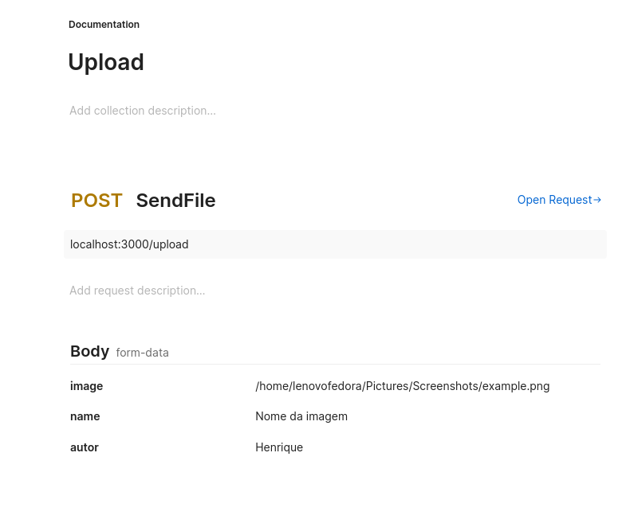

# NodeJS Image Upload API

This API allows you to upload images. It can be adjusted to upload other file formats by modifying the controller.

In this part of the code:

``` const validImageExtensions = ['.jpg', '.jpeg', '.png', '.gif'];

      // Verifica se o arquivo é uma imagem com base na extensão
      // Checks if the file is an image based on the extension
      const extension = path.extname(originalname).toLowerCase();
      if (!validImageExtensions.includes(extension)) {
        return res.status(400).send('The file is not an image.');
      }
```

The directory path where the files are saved is configured in **"utils/Uploads.js"**.

To configure the database connection, create a **.env** file:


Para configurar a conexão com o banco de dados, é preciso criar o arquivo ".env"
```
DATABASE_NAME=
DATABASE_PASSWORD=
DATABASE_USER=
DATABASE_HOST=
DATABASE_DIALECT=
DATABASE_PORT=

SERVER_PORT=
```

## How to Upload an Image

### Endpoint

- **URL**: `POST http://localhost:3000/upload`

### Request

- **Method**: `POST`
- **Content Type**: `form-data`

#### Parameters


- **image**: Select an image file.
- **name**: Image name.
- **author**: Image author.

### Example Request (using Postman)

Open Postman.
Configure the request as described above.
Send the request.


### Postman Example



To start the service, use:
```
npm start
```